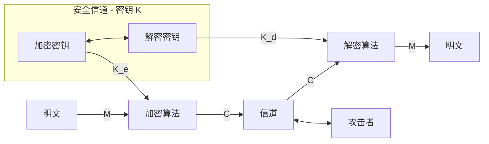
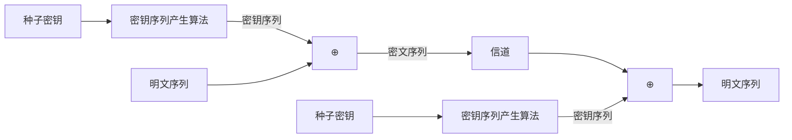
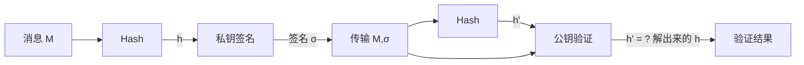

中国密码人在密码领域作出了许多杰出责献。2004年我国频布电子签名法。2006年我国政府开始陆续公布我国的商用密码算法。2007年中国密码学会正式成立。2011年9月,我国设计的祖冲之密码算法(ZUC)被批准成为新一代宽带无线移动通信系统(4G)国际标准。2015年月IS0/IEC接受 TPM2.0 为国际标准、TPM2.0支持中国商用密码(SM2、SM3、SM4)这些都是我国密码界的大事，反映出我国密码事业的紧荣与进步。

# 第1章 信息安全概论

传统信息安全强调信息数据本身的安全属性，认为信息安全主要包含： 1.信息的**秘密性**：信息不被未授权者知晓的属性。 2.信息的**完整性**：信息是正确的、真实的、未被篡改的、完整无缺的属性。 3.信息的**可用性**：信息可以随时正常使用的属性。

信息系统安全有以下四个层次：设备安全，数据安全，内容安全，行为安全。

网络空间安全学科的内涵：网络空间安全学科是研究信息获取、信息存储、信息传输和信息处理领域中信息安全保障问题的一门新兴学科。

网络空间安全学科的主要方向有：密码学、网络安全、信息系统安全、信息内容安全和信息对抗。

密码学：由密码编码学和密码分析学组成，密码编码学主要研究对信息进行编码以实现信息隐蔽，密码分析学主要研究通过密文获取对应的明文信息。主要研究内容有：①对称密码；②公钥密码；③Hash函数；④密码协议；⑤新型密码：生物密码，量子密码等；⑥密钥管理；⑦密码应用

### 1.4 网安学科理论基础

1.数学 现代密码分为基于数学的密码和基于非数学的密码（如量子密码和DNA密码），而后者正处于发展的初期没有得到广泛的实际应用。至于前者，学界普遍认为：设计一个密码就是设计一个数学函数，而破译一个密码就是求解一个数学难题。作为密码学理论基础之一的数学分支主要有代数、数论、概率统计、组合数学等。 协议安全是网络安全的核心，其基础之一的数学主要有逻辑学。 博弈论是网络空间安全学科基础理论之一，是现代数学的一个分支，是研究具有对抗或竞争性质的行为的理论与方法。博弈行为中，参加对抗或竞争的各方各自具有不同的目标或利益，并力图选取对自己最有利的或最合理的方案。博弈论考虑对抗双方的预期行为和实际行为，并研究其优化策略。

2.信息理论（信息论，控制论和系统论）。 信息论是香农为解决现代通信问题而创立的，控制论是维纳在解决自动控制技术问题中建立的，系统论是为了解决现代化大科学工程项目的组织管理问题而诞生的。 信息论对信息源、密钥、加密和密码分析进行了数学分析，用不确定性和唯一解距离来度量密码体制的安全性。信息论奠定了密码学，也奠定了信息隐藏的理论基础。 系统论是研究系统的一般模式、结构和规律的科学。 控制论研究动态系统在变化的环境条件下如何保持平衡状态或稳定状态。"控制"被定义为，为了改善受控对象的功能或状态，获得并使用一些信息，以这种信息为基础施加到该对象上的作用。

3.计算理论是网安学科重要理论基础 其中包括可计算性理论和计算复杂性理论等。 "一次一密"密码是理论上安全的密码，其余密码都只能是计算上安全的密码。根据计算复杂性理论的研究，NPC类问题是困难的，NPC类问题是NP类中最难计算的一类问题。公钥密码的构造往往基于一个NPC问题，以此期望密码是计算上安全的。NPC问题，以此期望密码是计算上安全的。如McEliece密码基于纠错码的一般译码是NPC问题。背包密码基于求解一般背包问题是NPC问题。MQ密码基于多变量二次非线性方程组的求解问题是NPC问题，等等。这说明计算复杂性理论是密码学的理论基础之一。

4.密码学理论是网络空间安全学科所特有的理论基础。 密码学在发展中超越了传统的信息论，形成了一些新理论，如：单向陷门函数理论、零知识证明理论以及密码设计与分析理论。因此，密码学理论是网安学科的理论基础，而且是网络空间安全学科特独有的理论基础。

5.访问控制理论是网络空间安全学科所特有的理论基础。 如信息系统中的身份认证就是最基本的访问控制。密码技术可以看作访问控制（密码技术中密钥就是权限，有密钥就可获得信息）。 访问控制理论包括各种访问控制模型与授权理论。例如，矩阵模型、BLP模型、BIBA模型、中国墙模型、基于角色的模型（RBAC）、属性加密，等等。其中属性加密是密码技术与访问控制结合的新型访问控制。

**综上可知，数学、信息理论（信息论、系统论、控制论）、计算理论（可计算性理论、计算复杂性理论）是网络空间安全学科的理论基础，而博弈论、密码学理论和访问控制理论是网络空间安全学科所特有的理论基础。**

### 1.5 网安学科的方法论基础

笛卡尔《方法论》中研究方法划分为四步：1.所有真理结论皆可怀疑。2.复杂问题拆分成小问题逐一解决。3.小问题先简单再复杂依次解决。4.所有问题解决后再综合检验看是否完全解决。 此方法忽略各个部分关联和彼此影响，有些复杂问题无法分解，推动系统工程的出现。（传统方法论→系统性方法论）

网安的方法论：将以上两者结合。包括理论分析、逆向分析、实验验证、技术实现。 强调底层性、系统性。 其中，逆向分析是网安学科特有方法论。因为信息安全领域的斗争，本质上是攻防双方之间的斗争。网络安全由网络安全防护和网络攻击组成，要从攻防两方面研究。

### 1.6 密码是网络空间安全的关键技术

密码技术的基本思想是对信息进行伪装以隐蔽信息。伪装就是对数据进行一组可逆的数学变换。伪装前的数据称为明文（Plaintext），伪装后的数据称为密文（Ciphertext）。伪装的过程称为加密（Encryption），去掉伪装恢复明文的过程称为解密（Decryption）。加解密要在密钥（Key）的控制下进行。 将数据以密文的形式存储在计算机的文件中或送人网络信道中传输，而且只给合法用户分配密钥。这样，即使密文被非法窃取，因为未授权者没有密钥而不能得到明文。 1949年香农发表《保密系统的通信理论》著名论文，对信息源、密钥、加密和密码分析进行了数学分析，用不确定性和唯一解距离来度量密码体制的安全性，阐明了密码体制、完善保密、纯密码、理论保密和实际保密等重要概念，把密码置于坚实的数学基础之上，标志着密码学作为一门独立的学科的形成。 很多情况下，难以预约使用相同密钥，密钥的传递过程中的保密工作本身就有难度。 1976年W.Diffie和M.E.Hellman提出公开密钥密码（PublicKeyCryptosystem）的概念，从此开创了一个密码新时代。公开密钥密码从根本上克服了传统密码在密钥分配上的困难，特别适合计算机网络应用，而且实现数字签名容易，因而特别受到重视。计算机网络中将公开密钥密码和传统密码相结合已经成为网络中应用密码的主要形式。 公认比较安全的公开密钥密码有：基于大整数因子分解困难性的RSA密码、基于有限域上离散对数问题困难性的ELGamal密码和基于椭圆曲线离散对数问题困难性的椭圆曲线密码（ECC）等。 1977年美国颁布了数据加密标准DES(Data Encryption Stantard),这是密码史上的一个创举。1973年，美国国家标准局(NBS)向社会公开征集一种用于政府机构和商业部门对非机密的敏感数据进行加密的加密算法。经美国国家安全局(NSA)评测后，选中了IBM公司设计的算法，颁布为标准DES。DES开创了向世人公开加密算法的先例。它设计精巧、安全、方便，是近代密码成功的典范。它成为商用密码的国际标准，为确保信息安全作出重大贡献。DES的设计充分体现了Shannon信息保密理论所阐述的设计密码的思想，标志着密码的设计与分析达到了新的水平。1998年年底美国政府宣布不再支持DES,DES完成了它的历史使命。1999年美国政府颁布三重DES为新的密码标准。三重DES已得到许多国际组织的认可，我国银行系统也采用三重DES。 1994年美国颁布了密钥托管加密标准EES（Escrowed Encryption Stantard）。EES密码算法被设计成允许法律监听的保密方式。EES只提供密码芯片，不公开密码算法。广受攻击。 1997年，重新公开征集新的数据加密标准算法AES（Advanced Encryption Stantard），成为美国国家标准，逐渐成为国际标准。我国银行系统现在也采用AES。也是全世界目前最常用。 1994年，美国颁布数字签名标准DSS（Digital Signature Stantard），并实际上成为国际标准。我国于1995年颁布自己的数字签名标准（带消息恢复的数字签名方案GB15851——1995）。 1995年，美国犹他州颁布世界上第一部《数字签名法》。2004年我国颁布《中华人民共和国电子签名法》。 2006年1月，我国政府公布了商用分组密码算法SM4，以后又陆续公布了商用公约密码算法SM2和商用HASH函数算法SM3。2006年我国制定了《可信计算平台密码技术方案》，明确规定了中国的可信计算密码模块（TCM）所应采用的中国商用密码算法。2007年中国密码学会正式成立。 2007年，美国NIST公开征集HASH函数新标准SHA-3，更为安全，可并行实现以获得很高的效率。可在多种平台包括智能卡等资源受限的平台中实现。

目前，针对密码破译的计算算法主要有两种。第一种是1996年提出的通用搜索破译法，第二种是1997年提出的在量子计算机上求解整数因子分解和求解离散对数问题的多项式时间算法。（对于后者算法的研究还在发展，其攻击能力已有量子傅里叶变换推广到一般情况下的隐藏子群问题，因此凡是可归结到HSP的公钥密码都不能抵抗量子计算的攻击）。

为对抗量子计算机攻击，有以下三种密码（抗量子计算密码）：基于量子物理学的量子密码，基于生物学的DNA密码和基于数学的抗量子计算密码。 1.量子密码。量子密码基于量子物理学。量子密码中比较成熟的是量子密钥分配（QKD）技术。它利用量子物理技术产生真随机数用作密钥，通过具有天然保密性的量子通信进行密钥分配，然后利用传统的序列密码方式对明文加密，密钥的使用采用"一次一密"。理论上，由于密钥随机且只用一次，分配信道是具有天然保密性的量子通信，量子态的测不准原理和量子态的不可克隆、不可删除原理确保了量子通信是安全的。 2.DNA密码。DNA计算有电子计算所无法比拟的优点，如高度并行性、极高的存储密度和极低的能量消耗。 3.基于数学的抗量子计算密码。量子计算机之所以能够有效攻击RSA、ELGmal、ECC等密码，是因为它擅长计算广义离散傅里叶变换问题，而据此可依据量子计算机不擅长计算的数学问题来构造抗量子计算密码。例如，基于二次方程组求解困难性的MQ密码，基于格困难问题的格密码等。

> **【新发展补充】抗量子密码（PQC）标准化已经落地。** 2024年8月13日，美国NIST正式发布首批3项后量子密码标准：
> 
> - **FIPS 203（ML-KEM）**：基于格的密钥封装机制，源自CRYSTALS-Kyber，用作通用加密替代RSA/ECDH。
> - **FIPS 204（ML-DSA）**：基于格的数字签名算法，源自CRYSTALS-Dilithium，是首选数字签名算法。
> - **FIPS 205（SLH-DSA）**：基于Hash的无状态签名算法，源自SPHINCS+，作为ML-DSA的备份。
> - **FIPS 206（FN-DSA）**：基于NTRU格的签名（FALCON），签名更小，2024年同时标准化。
> 
> 这是人类首次将抗量子密码作为正式标准发布。NSA的CNSA 2.0套件强制要求使用上述算法。当前最大可控逻辑量子比特数约为96（2026年），破解RSA-2048需约4000个逻辑量子比特，预计"密码学相关量子计算机（CRQC）"在2030s中后期到2040s中期出现。这意味着**当前部署的RSA/ECC在今日加密、未来解密（Harvest Now, Decrypt Later）攻击模式下已不安全**，长期机密数据应尽快迁移到PQC。

# 第二章 密码学的基本概念

## 2.1 密码学的基本概念

传统密码由于其在密钥分配上的困难而限制了它在计算机网络中的应用，在这种情况下产生了公开密钥密码。公开密钥密码从根本上克服了传统密码在密钥分配上的困难，而且实现数字签名容易，因而特别适合计算机网络和分布式计算机系统的应用。目前，在计算机网络中将公开密钥密码和传统密码相结合已经成为网络密码应用的主要形式 量子计算具有天然的并行性，所以量子计算机计算能力强大。

### 2.1.1密码体制

一个密码系统，通常简称为密码体制（Cryptosystem），由五部分组成： ① 明文空间 **M**，它是全体明文的集合。 ② 密文空间 **C**，它是全体密文的集合。 ③ 密钥空间 **K**，它是全体密钥的集合。其中每一个密钥 K 均由加密密钥 K_e 和解密密钥 K_d 组成，即 K = <K_e , K_d>。 ④ 加密算法 **E**，它是一族由 **M** 到 **C** 的加密变换。 ⑤ 解密算法 **D**，它是一族由 **C** 到 **M** 的解密变换。 对于每一个确定的密钥，加密算法将确定一个具体的解密变换，而且解密变换就是加密变换的逆变换。对于明文空间 **M** 中的每一个明文 $M$，加密算法 **E** 在密钥 $K_e$ 的控制下将明文 $M$ 加密成密文 $C$：

$$C = E(M, K_e) \quad (2\text{-}1)$$

而解密算法 **D** 在密钥 $K_d$ 的控制下由密文 $C$ 解密出同一明文 $M$：

$$M = D(C, K_d) = D(E(M, K_e), K_d) \quad (2\text{-}2)$$



|符号|英文全称|含义|
|---|---|---|
|**M**|**M**essage / **M**essage space|明文 / 明文空间（也常用 P = Plaintext）|
|**C**|**C**iphertext / **C**iphertext space|密文 / 密文空间|
|**K**|**K**ey / **K**ey space|密钥 / 密钥空间|
|**E**|**E**ncryption|加密算法 / 加密函数|
|**D**|**D**ecryption|解密算法 / 解密函数|
|**K_e**|**K**ey for **e**ncryption|加密密钥|
|**K_d**|**K**ey for **d**ecryption|解密密钥|

异或，即模2加法。两次异或⊕可得原文

### 2.1.2 密码分析

密码分析者攻击密码主要有三种方法： 1.穷举攻击。 依次试遍所有可能的密钥对所获得的密文进行解密。理论上，所有密码穷举可破；平均角度讲，穷举破译至少试遍所有可能密钥的一半。 应对：增大密钥量或增大加密算法复杂性。 2.数学攻击。 针对加密算法的数学基础和某些密码学特性，通过数学求解来破译。 应对：让这个基于数学难题的密码计算复杂性大到实际上不可计算。 eg.统计攻击：分析密文和明文的统计规律，大部分的古典密码可由此解。应对方法是设法使明文的统计特性不带入密文。 还有差分攻击、线性攻击、代数攻击、相关攻击等等。 3.物理攻击 针对密码系统或者密码芯片的物理特性，通过数学和物理的分析来破译密码。 物理攻击的理论依据是，任何密码算法在以硬件的形式工作时，必然与其工作环境发生物理交互，相互作用，相互影响。于是，攻击者就可以主动策划实施并检测这种交互、作用和影响，从而获得有助于密码分析的信息。这类信息被称为侧信道信息SCI（SideChannelInformation）。 基于侧信道信息的密码攻击被称为侧信道攻击或侧信道分析SCA（SideChannel attack/Analysis）。常用的侧信道信息有，能量消耗信息、时间消耗信息、声音信息，电磁辐射信息，等等。常见的侧信道攻击方法有，能量分析攻击、时间分析攻击、声音分析攻击、电磁辐射分析攻击、故障攻击，等等。 发展水平较高。有效攻击范围覆盖所有密码，包括传统密码（分组密码与序列密码）、公钥密码（RSA、ECC、EIGamal等）。

依据密码分析者的可用资源，密码攻击分以下四种： 1.仅知密文攻击2.已知明文攻击。3.选择明文攻击 4.选择密文攻击

### 2.1.3 密码学的理论基础

香农《保密系统的通信理论》从信息论的角度对信息源、密钥、加密和密码进行了数学分析，用不确定性和唯一解距离来度量密码体制的安全性，阐明了密码体制、完善保密、纯密码、理论保密和实际保密等重要概念，把密码置于坚实的数学基础之上，标志着密码学作为一门独立的学科的形成。 香农建议采用扩散（Diffusion）、混淆（Confusion）和乘积迭代的方法设计密码，并且还以"揉面团"的过程形象地比喻扩散、混淆和乘积迭代的概念。 扩散：就是将每一位明文和密钥数字的影响扩散到尽可能多的密文数字中。 混淆：使密文和密钥之间的关系复杂化。

2.2古典密码 2.2.1置换密码：只**重排**明文字符的位置而不改变字符本身，因此密文的字符频率和明文完全一致，仅靠字母频率分析就容易被攻破。 2.2.2代替密码：（1）加法密码（凯撒）（2）乘法密码（i先乘k再取模n,得j）（3）仿射密码（j=ik_1​+k_0 ​mod n）（4）密钥词语代替密码。如 山西平遥日昇昌票号使用笔迹认证、水印认证与密押认证（多表代替密码）。 2.2.3代数密码： 知识点：在数学上，如果一个变换的正变换和逆变换相同，f = f⁻¹，则称其为对合运算。例如，模 2 加运算 ⊕ 就是一种对合运算。因此，在密码设计中都希望将其加密算法设计成对合运算，这样使加解密共用同一算法，工程实现工作量减少一半。例如，著名的 DES 和 IDEA 等密码的加密运算都是对合运算。（比如说取相反数、取倒数等） 模二加=异或，异或（XOR）两次还原（相同得 0，不同得 1） 真正的随机数来自物理等熵源场景，纯靠算法必然伪随机。**真随机数来自物理熵源**（量子噪声、热噪声、放射性衰变等），其不可预测性是**物理性质**。 **纯算法产生的必然是伪随机**：由种子 + 确定性算法生成，统计上再漂亮也能被复现，因此**不能用于一次一密**等要求"完美保密"的场景。

2.3 古典密码的统计分析 2.3.1 语言的统计特性 字母E以及某些字母组常见 2.3.2 古典密码分析 加法密码穷举破解（如凯撒密码26种）； 乘法密码更容易破解，因为密钥整数k满足条件（n,k)=1即k与n互素，情况更少【φ(n) 表示在 1 到 n 这些整数中，与 n 互素的数有多少个，若n为素数φ(p)=p−1，若n为两不同素数乘积时φ(pq)=(p−1)(q−1)，若都不是则使用复杂的通用公式】； 仿射密码好一点，但可能的密钥也只有nφ(n)-1种【k1合法取值φ(n)，k2合法取值n】比如字母表的话只有26*12-1=311种）

2.4 SuperBase密码的破译 实操。

# 第三章 分组密码

### 3.1数据加密标准（DES）

**DES（Data Encryption Standard）** 是对称分组密码。

- 输入：64 位明文 + 64 位密钥（含 8 位奇偶校验，**有效 56 位**）
- 输出：64 位密文
- 结构：Feistel 网络 + SP 网络

DES 内部并行运行两条流水线。

### 数据流水线（加密明文）

```
64 位明文
  → IP 初始置换（无密码学意义）
  → 切成左右两半 L₀, R₀（各 32 位）
  → 16 轮 Feistel 迭代（每轮调用 F 函数）
  → 左右交换
  → IP⁻¹ 逆置换
→ 64 位密文
```

### 密钥流水线（生成子密钥）

```
64 位主密钥
  → PC-1 置换（去 8 位校验，留 56 位，分成 C₀, D₀ 各 28 位）
  → 每轮把 C 和 D 各循环左移 1 或 2 位
  → PC-2 选择（56 位中挑 48 位）
→ 16 个子密钥 K₁ ~ K₁₆（每个 48 位）
```

**两条流水线的唯一交汇点**：每生成一个 K_i 就送给数据流水线对应那一轮的 F 函数。

一句话核心总结

**DES = 用 56 位密钥把 64 位明文，通过 Feistel 结构做 16 轮"扩散+混淆"迭代，得到 64 位密文。所有非线性都来自 F 函数里的 8 个 S 盒；密钥编排只做线性的置换和移位；加解密共用同一电路，仅子密钥反序。**

DES的弱点： 1.密钥较短。采用56位密钥 2.存在弱密钥。比如16次加密迭代中，可能出现相同的子密钥。 3.存在互补对称性。DES 中"密钥取非"和"明文取非"会在 F 函数第一处异或里互相抵消，使 S 盒输入不变；第二处异或又把这种"非"传到输出。结果就是 C‾=DES(M‾,K‾)\overline{C} = \text{DES}(\overline{M}, \overline{K}) C=DES(M,K)。攻击者多查询一次互补明文，就能在穷举时让每次试探同时覆盖两个候选密钥，工作量减半（56 位 → 55 位有效强度）

3DEC 3DES：是DES的改进版，密钥长度168位，可抗穷举攻击。（其实就是做3次DES加密），1999年发布。 2001年，AES正式发布。

3.2 IDEA密码算法 **IDEA 是 1991 年瑞士设计的 64 位分组、128 位密钥的对称密码，用三种代数上互不相容的运算（异或、模加、模乘）替代了 DES 那种查表式 S 盒，结构上用 Lai-Massey 代替 Feistel。它设计优雅、安全性长期可靠，但因专利问题（1991-2012）和 AES 的崛起而未能普及，主要历史功绩是作为早期 PGP 邮件加密的核心算法。**

**与 DES 的本质区别**：DES 把非线性放在 S 盒查找表里，IDEA 把非线性放在代数运算的不相容性里——同样的安全目标，两种完全不同的实现哲学。

3.3 高级数据加密标准（AES）

3.4 SM4算法 SM4分组密码算法是我国自主设计的分组对称密码算法，前身是SMS4分组加密算法（中国无线标准中使用的分组加密算法），2012年被国家商用密码管理局确定为国家密码行业标准。 密钥长度和明文分组长度都为128位（是对称分组算法），加密算法与密钥拓展算法均采用非线性迭代结构，运算轮数为32轮。解密时轮密钥的使用顺序相反，解密轮密钥是加密轮密钥的逆序。 word字 ：长度为32比特的组（串） 32次迭代运算+1次反序变换R组成

3.5 KASUMI密码

# 第4章 分组密码分析

密码攻击方式主要有三种：穷举攻击、数学攻击和物理攻击

---

# 分组密码 vs 序列密码

## 本质区别

|对比维度|分组密码 (Block Cipher)|序列密码 (Stream Cipher)|
|---|---|---|
|**加密单位**|**整块**（如64/128位）一起处理|**逐位/逐字节**处理|
|**加密方式**|用同一密钥对每个分组做**复杂的非线性变换**|用密钥生成**伪随机密钥序列**，与明文逐位异或|
|**理论模型**|香农"乘积密码"——扩散+混淆+多轮迭代|仿效"一次一密"——只是序列伪随机不是真随机|
|**状态**|无状态（同明文同密钥总得同密文，需工作模式破除）|有状态（内部寄存器随每个比特变化）|
|**错误传播**|CBC等模式下一位错→后续整块全乱|异或方式下一位错→只对应一位错（无传播）|
|**实现**|软硬件均可，硬件需较大面积|硬件极简（移位寄存器+少量门），适合资源受限场景|
|**速度**|较慢（多轮迭代）|快（一次异或）|
|**典型应用**|数据存储、文件加密、TLS对称加密|移动通信、卫星通信、流媒体|
|**代表算法**|DES、3DES、**AES**、IDEA、**SM4**|RC4、A5/1、**ZUC（祖冲之）**、Salsa20/ChaCha20|

## 关键观察

1. **分组密码可以"序列化"**：通过 OFB/CFB/CTR 工作模式，分组密码（如AES）可以当作序列密码用，产生密钥流。所以现实工程中**两者并非对立**——CTR 模式的 AES 实际就是序列加密。
2. **序列密码的核心是密钥序列产生算法**：加解密器只是一个异或门，关键是**伪随机性 + 不可预测性 + 长周期**。
3. **同步问题**：序列密码要求收发方密钥流严格同步，丢一位就全乱；分组密码无此问题。

## 序列密码主要算法

### 线性反馈移位寄存器（LFSR）

- 经典模型：$n$ 级寄存器 + 线性反馈函数。
- 输出周期最长为 $2^n-1$（m序列）。
- **致命缺陷**：线性，**仅需2n位连续密钥流**就能用Berlekamp-Massey算法解出本原多项式。
- 故实际使用必须加**非线性组合**（非线性组合生成器、非线性滤波生成器、钟控生成器）。

### A5/1

- 2G GSM 手机话音加密算法。
- 3个不规则钟控的LFSR。
- 已被实际破译（2009年彩虹表攻击），现代手机改用 KASUMI/ZUC。

### RC4

- 1987年 Ron Rivest 设计，长期保密，1994年被逆向公开。
- 基于**非线性数据表变换**（256字节 S 表 + 两个指针 $I,J$），不用移位寄存器。
- 状态空间 $256! \approx 2^{1684}$，穷举不可行。
- 曾广泛用于 SSL/TLS、WEP、WPA。
- **现状：已不安全。** 偏置统计攻击+WEP漏洞导致 IETF 在 RFC 7465（2015）中明确禁止 TLS 使用 RC4。

### 祖冲之密码（ZUC, ZU Chong-zhi）

- **我国自主设计**，2011年9月被3GPP批准为4G LTE国际标准，**首个走出国门的中国商密**。
- 算法分上中下三层：
    - 上层：16级LFSR（在 $GF(2^{31}-1)$ 上）——保证 m 序列良好随机性。
    - 中层：比特重组（BR）——从 LFSR 取 128 位拼成 4 个 32 位字。
    - 下层：非线性函数 F——引入非线性。
- 配套两个算法：
    - **128-EEA3**：机密性算法（流加密）
    - **128-EIA3**：完整性算法（MAC）

> **【新发展】ZUC-256 已就位。** 为应对5G、6G和后量子时代256比特安全强度需求，研制组提出 **ZUC-256**：密钥长度从128位升级到256位，与ZUC-128高度兼容。2024年5月 ETSI TS 135 246 V18.0.0（3GPP R18）正式发布，标志 5G 加密进入 256 比特安全时代，对应套件 **256-NEA3/NIA3**。

### Salsa20 / ChaCha20（补充：现代主流序列密码）

- Daniel J. Bernstein 设计，2008/2013 年。
- **ChaCha20 + Poly1305** 已成为 TLS 1.3、WireGuard、安卓的主流对称加密方案，**在没有AES硬件加速的移动设备上比AES更快**。书中未提，但是2015年以后的密码工程重点。

## 一句话核心总结

**分组密码用"复杂变换"换安全，序列密码用"长伪随机序列"换安全；前者强在数据加密（AES/SM4），后者强在通信加密（ZUC/ChaCha20）；两者通过工作模式可以互相变形，并非互斥。**

---

# 第5章 序列密码

## 5.1 序列密码的概念

"一次一密"理论上不可破译，但密钥必须**真随机、与明文等长、只用一次**——实际不可行。 序列密码就是**用短种子密钥控制算法，源源不断产生伪随机密钥序列**，再与明文逐位异或加密——对"一次一密"的工程化仿效。

模型：



关键：通信双方必须**精确同步**，且双方能产生相同密钥序列——所以密钥序列**不可能是真随机，只能是伪随机**。

## 5.2 随机序列的安全性

密钥序列质量评价：**周期性、随机性、不可预测性、线性复杂度**。

- **周期长**：避免重复出现统计规律。
- **0/1平衡**：游程分布要符合随机统计特性（Golomb 三准则）。
- **线性复杂度高**：抗 Berlekamp-Massey 算法重构。
- **不可预测**：知前 $n$ 位推不出下一位。

## 5.3 线性反馈移位寄存器（LFSR）

$n$ 级寄存器，反馈函数为本原多项式 → 输出**m 序列**，周期为 $2^n-1$，统计性极好。 但**线性可破**：知道 $2n$ 位输出，B-M 算法即可推出整个寄存器结构。

## 5.4 非线性序列

四种构造法：

1. **非线性组合生成器**：多个 LFSR 输出送入非线性布尔函数。
2. **非线性滤波生成器**：单 LFSR 多个抽头送入非线性布尔函数。
3. **钟控序列生成器**：用一个 LFSR 的输出控制另一个 LFSR 是否移位。
4. **利用强分组密码产生**：以 AES/SM4 在 OFB/CFB/CTR 模式下产生密钥序列——只要分组密码安全，序列也安全。

## 5.5 祖冲之密码（ZUC）

> 见上节"序列密码主要算法"补充。这里强调一下三层结构的设计哲学：
> 
> - LFSR 保证 m 序列的**良好统计性**与**长周期**；
> - BR 把上层状态"切割重组"，**打破线性结构**；
> - F 函数引入**强非线性**——这是抗 B-M 攻击的关键。
> 
> 三层叠加 = "长周期 + 不可预测 + 非线性"，是现代序列密码的设计范式。

## 5.6 RC4

见上节。

## 一句话核心总结

**序列密码 = 用密码学算法对真随机的"一次一密"的工程化仿效；核心问题是设计一个状态空间大、非线性强、统计性好的密钥序列产生算法。**

---

# 第6章 Hash函数

Hash 函数 $H: {0,1}^* \to {0,1}^n$ 将任意长输入压缩为固定长摘要。

**三大安全性**：

1. **单向性（抗原像）**：已知 $h$ 找 $M$ 使 $H(M)=h$ 计算不可行。
2. **抗第二原像**：已知 $M_1$ 找 $M_2 \neq M_1$ 使 $H(M_1)=H(M_2)$ 计算不可行。
3. **抗碰撞性**：找任意 $M_1 \neq M_2$ 使 $H(M_1)=H(M_2)$ 计算不可行。

**生日攻击**：找碰撞的代价约为 $2^{n/2}$，因此 $n$ 必须足够大（现在标准要求 ≥ 256）。

## 主要算法

|算法|摘要长度|现状|
|---|---|---|
|MD5|128|**已彻底破解**（王小云2004），禁用|
|SHA-1|160|**已破解**（Google 2017 SHAttered），禁用|
|SHA-2（SHA-256/384/512）|256/384/512|目前安全，广泛使用|
|**SHA-3（Keccak）**|224/256/384/512|2015 年 NIST 标准，基于海绵结构，与SHA-2数学基础完全不同，作为备份|
|**SM3**|256|**我国商用Hash标准**，类Merkle-Damgård 结构，王小云等设计，2010年发布，已成为 ISO/IEC 国际标准|

> **【没看懂的注解】信息隐藏的信息论解释**：把"原始宿主信号"（图片、音频等）看作**带宽很宽的信道**，把"隐藏信息"看作**带宽很窄的弱信号**。借助扩频通信，把弱信号能量"摊"到整个宿主信道里——任何一个特征上的能量都低于噪声门限，**统计上检测不到**。所以信息隐藏的检测，本质是"有噪信道中的弱信号检测问题"——这正是信息论研究的核心问题之一。

---

# 第7章 公开密钥密码

## 7.1 基本概念

传统密码（对称密码）通信前双方必须**预先共享密钥**——这在大型计算机网络上极不现实：

- $n$ 个用户两两通信需要 $C_n^2 = n(n-1)/2$ 个密钥对，规模爆炸。
- 商业陌生方间无法预约。
- 密钥分发本身又需要保密信道——鸡生蛋问题。

**1976年 Diffie 和 Hellman《密码学新方向》**提出**公开密钥密码**（Public-Key Cryptography）思想，开创密码新时代。

**核心思想**：把密钥 $K$ 一分为二：加密密钥 $K_e$ 公开（公钥），解密密钥 $K_d$ 保密（私钥）。从 $K_e$ 在**计算上不能**推出 $K_d$。

**三个必要条件**：

1. $D(E(M, K_e), K_d) = M$ ——构造条件（解密必须能还原）。
2. **由 $K_e$ 在计算上不能求出 $K_d$** ——安全条件，核心难点。
3. $E$ 与 $D$ 都是**高效的** ——实用条件。

**单向陷门函数**：正向（加密）易算，逆向（解密）难算，但**知道陷门（私钥）就易算**。公钥密码就是设计这种函数。

## 7.2 RSA密码（1978）

> **背景**：MIT 的 Rivest、Shamir、Adleman 三人提出。基于**大整数因子分解困难性**。RSA 既可加密又可签名，"风格优雅"，是目前应用最广的公钥密码（ISO、ITU、SWIFT、TCG标准；SET、PGP核心）。

### 算法流程

密钥生成：

1. 随机选两个大素数 $p, q$（保密）。
2. 计算 $n = pq$（公开）。
3. 计算 $\varphi(n) = (p-1)(q-1)$（保密；欧拉函数）。
4. 随机选正整数 $e$，使 $1 < e < \varphi(n)$ 且 $\gcd(e, \varphi(n)) = 1$（公开）。
5. 用扩展欧几里得算法求 $d$ 使 $ed \equiv 1 \pmod{\varphi(n)}$（保密）。

公钥 $K_e = \langle n, e \rangle$，私钥 $K_d = \langle p, q, d, \varphi(n) \rangle$。

加密：$C = M^e \mod n$ 解密：$M = C^d \mod n$

**算法正确性**：由欧拉定理 $M^{\varphi(n)} \equiv 1 \pmod{n}$ 且 $ed \equiv 1 \pmod{\varphi(n)}$ 推出 $C^d = M^{ed} = M^{k\varphi(n)+1} \equiv M \pmod n$。

### 安全性

- 攻击者已知 $n, e$，要求 $d$，必须先求 $\varphi(n) = (p-1)(q-1)$，必须先**分解 $n = pq$**。
- 大整数因子分解目前最快算法是**数域筛法**，亚指数复杂度——使得 RSA 计算上安全。
- **当前安全标准**：$n$ 至少 2048 位（2030年后建议 3072 位以上）。1024 位的 RSA 已不安全。
- **致命威胁**：Shor 算法可在量子计算机上**多项式时间**分解大整数——RSA 在量子时代不安全。

### 应用

- 加密（实际中用来**加密对称密钥**而非数据本身，因为RSA慢约1000倍）。
- 数字签名（RSA是少数同时支持加密和签名的算法）。
- TLS/SSL 密钥交换、Email 签名（S/MIME、PGP）、SET 协议等。

## 7.3 ELGamal密码（1985）

> 基于**有限域上离散对数问题（DLP）困难性**：给定素数 $p$、本原元 $\alpha$、$y = \alpha^x \mod p$，求 $x$ 困难。

### 算法流程

公共参数：大素数 $p$，本原元 $\alpha$。

**密钥生成**：选 $d \in [1, p-1]$ 作为私钥，计算 $y = \alpha^d \mod p$ 作为公钥。

**加密**（明文 $M \in [0, p-1]$）：

1. 随机选 $k \in [1, p-1]$。
2. 计算 $C_1 = \alpha^k \mod p$，$C_2 = M \cdot y^k \mod p$。
3. 密文 $(C_1, C_2)$。

**解密**：$M = C_2 \cdot C_1^{-d} \mod p = M \cdot y^k \cdot \alpha^{-kd} = M \cdot \alpha^{kd} \cdot \alpha^{-kd} = M$。

### 特点

- **概率加密**：同明文每次加密因 $k$ 不同而密文不同——抗选择明文攻击优于 RSA。
- 密文长度是明文 2 倍（膨胀因子 2）。
- 与 RSA 同安全级别时密钥长度相近。
- **Diffie-Hellman 密钥交换、美国DSA 数字签名标准**都建立在 DLP 上。

## 7.4 椭圆曲线密码（ECC, 1985）

> Koblitz 和 Miller 各自独立提出。基于**椭圆曲线离散对数问题（ECDLP）困难性**。

### 核心思想

将 ELGamal 的"乘法群上离散对数"搬到**椭圆曲线点群**上。

椭圆曲线方程（有限域 $GF(p)$ 上，$p>3$）： $$y^2 = x^3 + ax + b \pmod p, \quad 4a^3 + 27b^2 \not\equiv 0$$

曲线上点 + 无穷远点 $O$ 构成**阿贝尔群**，运算为"点加"（几何上：过 $P,Q$ 作直线交曲线第三点取关于 x 轴对称）。

**ECDLP**：已知 $P$ 和 $Q = tP$（$t$ 是整数，$tP$ 表示 $P$ 自加 $t$ 次），求 $t$ 困难。

### 优势

**等同安全强度下密钥短得多**：

|安全级别|RSA密钥|ECC密钥|
|---|---|---|
|80 位|1024 位|160 位|
|128 位|3072 位|256 位|
|192 位|7680 位|384 位|
|256 位|15360 位|512 位|

→ 计算快、带宽省、存储小，**特别适合移动终端、智能卡、IoT 设备**。

### 应用

比特币/以太坊签名（secp256k1）、TLS 1.3 密钥交换（X25519）、苹果 iMessage、我国二代身份证（256位ECC）。

> **【新发展】Curve25519/Ed25519**：Bernstein 设计的现代椭圆曲线，避免NIST曲线疑似后门，简单、快速、安全，已成为 TLS 1.3、SSH、WireGuard、Signal 的标配。

## 7.5 SM2椭圆曲线公钥密码（中国商用密码）

> 2010年12月由我国国家密码管理局发布，2012年成为商密标准，2017年成为 ISO/IEC 国际标准。**用以替代 RSA**。

特点：

- 基于 ECC 框架，但采用**国内推荐的特殊曲线参数**（256位素域 $F_p$）。
- 包含三个子算法：**SM2-1（加密）**、**SM2-2（数字签名）**、**SM2-3（密钥交换）**。
- 强制使用 SM3 作为内部 Hash 函数。
- 与国际标准 ECC 在数学上一致，但参数、流程、Hash 选择均有差异——确保自主可控。

## 一句话核心总结

**公钥密码 = 一对计算上单向相关的密钥（陷门函数）；RSA 基于因子分解，ELGamal/ECC 基于离散对数；ECC 在等安全强度下密钥最短、最适合移动端；SM2 是我国版 ECC。RSA/ECC 都将被量子计算威胁——这是密码学正在经历的"地壳运动"。**

---

# 第8章 数字签名

## 8.1 数字签名的概念

**数字签名（Digital Signature）**：用密码技术对数字消息进行签名，证明消息真实性、签名者身份，并防止抵赖。

完善的签名必须满足三条件：

1. **签名者事后不能抵赖** ——不可否认性。
2. **任何人不能伪造签名** ——不可伪造性。
3. **争议可被仲裁** ——可验证性。

数字签名 vs 书面签名：

- 书面签名：依赖物理特征（笔迹、印章雕刻、指纹）。
- 数字签名：依赖**密码学安全性**——理论上比书面签名更强。

可实现的签名类型：通用签名、仲裁签名、代理签名、**盲签名**（签名者不知道内容，用于电子选举、电子现金）、**群签名**、**门限签名**（$t$-out-of-$n$ 签名才有效）等。

### 为什么用公钥密码实现数字签名"更容易"？

> 这是用户的【没看懂】问题。这里详解。

**对称密码做签名很困难**：

- 双方共享同一密钥 $K$，任何一方都能用 $K$ 生成消息认证码 → **不能区分是谁签的** → 无法防止抵赖、不能仲裁。
- 必须引入可信第三方做仲裁（仲裁签名），过程复杂、效率低、依赖第三方安全。

**公钥密码做签名很自然**：

- 私钥 $K_d$ 只有签名人持有，公钥 $K_e$ 全世界公开。
- **签名 = 用私钥对消息（或其Hash）变换**：$S = \text{Sig}(M, K_d)$
- **验证 = 用公钥对签名变换**：$\text{Ver}(S, K_e) \stackrel{?}{=} M$
- 任何人都能验证（用公钥），但只有持私钥者能签名 → **天然满足不可否认 + 不可伪造 + 可验证**。
- **不需要可信第三方做仲裁**（CA 只用来证明公钥归属，不参与签名验证过程）。

→ 这就是公钥密码"实现数字签名容易"的本质。

### 签名通用流程（消息长则先 Hash）



> **为什么要先 Hash？** ①消息可能很长，公钥运算慢，先压缩成定长摘要再签名；②防止某些可延展性攻击。

## 8.2 利用公钥密码实现数字签名

### 8.2.1 RSA 签名

A 的密钥：公钥 $K_{eA} = \langle e, n \rangle$，私钥 $K_{dA} = \langle d, p, q, \varphi(n) \rangle$。

**签名**：$S_A = M^d \mod n$（实际中是对 $H(M)$ 签名） **验证**：$M' = S_A^e \mod n$，校验 $M' = M$（或 $H(M)$）。

注：RSA 加密用公钥，签名用私钥——**对称的两个方向**。这是 RSA 既能加密又能签名的根源。

### 8.2.2 ELGamal 签名

基于 DLP。公钥 $y = \alpha^d \mod p$，私钥 $d$。

签名消息 $M$（先 Hash 为 $h$）：

1. 选随机 $k \in [1, p-2]$，且 $\gcd(k, p-1) = 1$。
2. $r = \alpha^k \mod p$。
3. $s = (h - dr) k^{-1} \mod (p-1)$。
4. 签名为 $(r, s)$。

验证：$\alpha^h \stackrel{?}{=} y^r r^s \mod p$。

注意：每次签名 $k$ 必须**新鲜随机且保密**；若 $k$ 重用或泄露 → 私钥 $d$ 可解出（**索尼 PS3 ECDSA 灾难就是这种错误**）。

### 8.2.3 椭圆曲线签名（ECDSA）

将 ELGamal 签名搬到椭圆曲线点群。结构同上，运算从模乘改为点加点乘。

应用：**比特币/以太坊钱包签名**（secp256k1）、TLS 服务器证书、Apple Pay、Android Keystore。

## 8.3 SM2 数字签名算法

我国商用数字签名标准，建立在 SM2 椭圆曲线上，结构类似 ECDSA 但参数和细节有别（强制配 SM3 做哈希）。 2017年被 ISO/IEC 14888-3 接受为国际标准——**中国数字签名算法首次成为国际标准**。

## 8.4 美国数字签名标准 DSS

历史：

- 1991 年 NIST 提出 DSA 算法（基于 ELGamal 改进）。
- 1994 年颁布为 FIPS 186 标准（DSS）。
- 2000 年扩充：DSA + RSA + ECDSA。
- **2013 年 FIPS 186-4**：现行版本。
- **2024 年 FIPS 204（ML-DSA）**：基于格的后量子签名，作为下一代标准。

> **新发展**：除 SM9（基于身份的签名，2016 发布，2021 成 ISO 国际标准）外，**抗量子签名 ML-DSA / SLH-DSA / FN-DSA** 已在 2024 年 8 月正式标准化。Microsoft、Apple、Google 已开始在 TLS、HTTPS、签名 CA 链中部署"经典+PQC 混合签名"，迁移浪潮已经开始。

## 一句话核心总结

**数字签名 = 用私钥变换 + 公钥验证；公钥密码是天然适配数字签名的工具，因为"只我能签 + 谁都能验"恰好对应"私钥 + 公钥"的非对称属性；从 RSA → DSA/ELGamal → ECDSA → SM2 → ML-DSA，主线是"等安全更短 + 抗量子"。**

---

# 总结

## 总结一：对称密码 vs 非对称（公开密钥）密码

### 对照表

|对比维度|对称密码（传统密码）|非对称密码（公开密钥密码）|
|---|---|---|
|**密钥关系**|加密、解密用**同一密钥**|公钥加密，私钥解密；私钥签名，公钥验证|
|**密钥分发**|困难（需安全信道预约）|容易（公钥可公开）|
|**密钥总数**|$n$ 用户需 $n(n-1)/2$ 个密钥|$n$ 用户只需 $n$ 对密钥|
|**数学基础**|香农扩散+混淆+迭代（多轮非线性变换）|单向陷门函数（因子分解 / 离散对数）|
|**速度**|快（DES 等比 RSA **快约 1000 倍**）|慢（基于大整数模幂运算）|
|**加密数据量**|适合大数据加密|仅适合小数据（如对称密钥本身、Hash摘要）|
|**数字签名**|实现困难（需可信第三方仲裁）|**天然适合**（私钥签名 + 公钥验证）|
|**抗量子**|AES-256、SM4 暂时安全（Grover 算法只把强度减半，提到256即可）|RSA/ECC 在量子下**完全破解**（Shor 算法）|
|**典型算法**|DES、3DES、**AES**、IDEA、**SM4**、ChaCha20、ZUC|RSA、ELGamal、ECC、**SM2**、ML-KEM、ML-DSA|

### 工程实践——混合密码体制

两者并非对立，而是**协同**：

1. 用**公钥密码**完成密钥分发（如 TLS 握手中的 ECDHE）和身份认证（证书签名）。
2. 用**对称密码**完成实际数据加密（如 TLS 记录层的 AES-GCM / ChaCha20-Poly1305）。
3. 用**Hash + 公钥**完成数字签名（消息完整性、不可否认）。

这就是 TLS、SSH、PGP、SET、VPN 等**所有现代密码协议**的统一架构。

### 一句话核心总结

**对称密码"快但难分发"，非对称密码"慢但易分发"；现代密码体系不是二选一，而是"非对称分发对称密钥 + 对称加密数据 + 哈希签名"的三件套。**

---

## 总结二：国产密码（商用密码）算法

我国商用密码算法体系由**国家密码管理局**主导，对应国际算法都有**自主可控的国产替代**。

### 算法全景

|算法|类型|对标国际|发布年份|备注|
|---|---|---|---|---|
|**SM1**|对称分组|DES/AES|—|**不公开**，仅密码芯片内调用|
|**SM2**|公钥（椭圆曲线）|RSA / ECDSA|2010|加密+签名+密钥交换，256位ECC|
|**SM3**|Hash 函数|SHA-256|2010|256位摘要，王小云等设计|
|**SM4**|对称分组|AES|2006（SMS4）/ 2012（SM4）|128位密钥/分组，32轮非线性迭代|
|**SM7**|对称分组|—|—|**不公开**，用于非接触IC卡|
|**SM9**|标识密码（IBC）|—|2016|**基于身份**，无需数字证书，加密强度≈3072位 RSA|
|**ZUC（祖冲之）**|序列密码|SNOW 3G|2011|4G LTE 国际标准|
|**ZUC-256**|序列密码|—|2018 草案 / 2024 标准|5G 256位安全|

### 国密"三大件"——SM2 / SM3 / SM4

最常用、最重要、最强制：

- **SM2** 替 RSA / ECDSA
- **SM3** 替 SHA-256
- **SM4** 替 AES

被广泛要求用于：

- 金融（银联）、政务（电子政务外网）、电力（国家电网协议）、税务（金税）
- **强制合规**：《密码法》（2020年1月1日施行）、《商用密码管理条例》、《信息安全等级保护2.0》

### SM9 ——标识密码（IBC）的独特性

- 公钥 = 用户标识（邮箱、手机号、姓名）本身——**无需 CA 颁发数字证书**。
- 私钥由可信"密钥生成中心 KGC"基于主密钥+标识生成。
- 适合大规模物联网、邮件加密、车联网、隐私计算场景。
- 2021 年 ISO/IEC 14888-3 接受 SM9 数字签名为国际标准——**我国首个全体系国际化的非对称密码**。

### 国密"国际化"成绩单

- **2017 年**：SM2、SM9 数字签名 → ISO/IEC 14888-3。
- **2017 年**：SM3 → ISO/IEC 10118-3。
- **2021 年**：SM2 加密、SM9 加密与密钥协商 → ISO/IEC。
- **2021 年**：SM4 → ISO/IEC 18033-3。
- **2011/2024 年**：ZUC-128、ZUC-256 → 3GPP / ETSI 5G 标准。

### 一句话核心总结

**国产密码 SM2/SM3/SM4/SM9/ZUC 已构建从对称、Hash、公钥到标识密码、序列密码的完整体系，对标AES/SHA/RSA/ECC的所有国际算法均有自主替代，且大多已成为 ISO/3GPP 国际标准——这是密码主权的根本保障。**

---

## 总结三：移动互联网时代的信息安全与防护

### 时代背景：从"网络"到"移动互联网+万物互联"

移动互联网把密码学的应用场景彻底改写：

- **设备爆炸**：手机、手表、汽车、家电、传感器，每一台都需要密码学。
- **算力受限**：嵌入式 CPU、电池容量、带宽，RSA-2048 无法承受。
- **物理失控**：设备会丢失、被拆解、被侧信道分析。
- **网络复杂**：4G/5G/Wi-Fi/蓝牙/NFC 多通道叠加。
- **数据敏感**：位置、生物特征、支付、健康，比传统数据更隐私。

### 关键威胁

1. **侧信道攻击**：功耗、时间、电磁、声音分析——**所有部署在手机/IoT 上的密码芯片都受威胁**。
2. **中间人攻击**：公共Wi-Fi、伪基站。
3. **应用层泄露**：恶意 App、SDK 偷数据。
4. **设备物理失窃**：手机丢失后数据保护。
5. **量子威胁**："今日加密、未来解密"：现在被截获的密文，未来量子计算机会全部破译。

### 防护技术栈（自下而上）

#### 1. 硬件信任根

- **SE（Secure Element，安全元件）**：独立安全芯片（如银行卡的 EAL5+ 芯片）。
- **TEE（Trusted Execution Environment，可信执行环境）**：基于 ARM TrustZone / Intel SGX，在主处理器中划出"安全世界"。
    - 苹果 Secure Enclave、谷歌 Titan M、华为麒麟内置 inSE/TEE。
    - 用于：指纹/人脸密钥保护、移动支付（Apple Pay、银联手机闪付）、DRM、密钥存储。
- **PUF（Physical Unclonable Function）**：用芯片物理瑕疵生成"芯片指纹"，无法克隆。

#### 2. 通信层加密

- **TLS 1.3**（2018 RFC 8446）：移除所有不安全套件（RC4、DES、SHA-1、CBC、RSA密钥交换），只保留 AEAD（AES-GCM/ChaCha20-Poly1305）+ ECDHE 前向安全。
- **5G AKA**：基于 USIM + ZUC/AES，引入 SUCI（用户永久标识加密）防 IMSI 嗅探。
- **端到端加密（E2EE）**：Signal Protocol（双棘轮算法）、iMessage、WhatsApp。中间服务商也读不到明文。

#### 3. 身份认证

- **生物识别**（指纹、人脸、虹膜）：本地匹配，模板存 TEE/SE，**绝不上传服务器**。
- **FIDO2 / WebAuthn**：取代密码的标准，基于 ECDSA/Ed25519 公钥认证 + 硬件密钥（U盾、YubiKey、手机指纹）。
- **零信任架构（Zero Trust）**："从不信任、永远验证"，每次访问都做身份+设备+行为风险检查。

#### 4. 数据保护

- **全盘加密**：iOS Data Protection、Android FBE，**密钥与设备 PIN+硬件根绑定**。
- **同态加密、安全多方计算（MPC）、联邦学习、差分隐私**：让数据"可用不可见、可控不可篡"——数据出域不裸奔。
- **区块链/Merkle树**：分布式信任与数据不可篡改证明。

#### 5. 应用层

- **APP 签名校验**：防止恶意篡改。
- **代码混淆与白盒密码学（White-Box Cryptography）**：在没有 TEE 的环境中，把密钥"溶解"进代码，防止逆向。
- **运行时保护（RASP）**：检测 Hook、调试、root/越狱、模拟器。

### 标准与法律

- 我国《**密码法**》（2020.1.1）：分核心密码、普通密码、商用密码三级管理，关键信息基础设施**强制使用商用密码**。
- 《**网络安全法**》《**数据安全法**》《**个人信息保护法**》（"三法"）。
- 等保2.0：分等级强制密码合规。
- GDPR（欧盟）、CCPA（加州）等域外法律。

### 关键趋势

1. **后量子迁移**：FIPS 203/204/205 已发布，TLS、HTTPS、CA 正在落地"经典+PQC 混合"模式。预计 2030 年代完成主流系统迁移。
2. **隐私计算大爆发**：MPC、FHE（全同态）、TEE、联邦学习相互融合，进入金融、医疗、AI 训练。
3. **AI × 密码**：用 AI 做侧信道分析（攻），用密码保护 AI 模型权重和训练数据（防）。
4. **国密深化**：国密SSL、TLCP（传输层密码协议）、密评（商密应用安全性评估）从合规走向常态。
5. **量子密钥分发（QKD）网络**：墨子号卫星量子通信、京沪干线 QKD 骨干网；与 PQC 形成"物理+数学"双保险。

### 一句话核心总结

**移动互联网时代的密码学不再是"算法+协议"两层，而是"硬件根 → 算法 → 协议 → 应用 → 法律"五层一体；防护核心从"加密信道"转向"零信任 + 端到端 + 硬件可信根 + 隐私计算"；下一个十年的关键词是"后量子迁移"和"隐私计算落地"。**

---

# 个人疑问澄清区

## ✅ 已澄清：为什么公钥密码"实现数字签名更容易"？

对称密码下双方共享一把钥匙，无法区分"是谁签的"，必须靠第三方仲裁。公钥密码下私钥唯一持有人即签名人，公钥任何人都能验证——**"只我能签 + 谁都能验"恰好对应"私钥 + 公钥"非对称属性**，天然实现不可否认、不可伪造、可验证。详见第8.1节。

## ✅ 已澄清：量子计算对密码的威胁与紧迫性

> 原笔记中【没看懂】部分：通用搜索破译法 + 量子多项式时间分解整数。

- **Shor 算法（1994）**：在量子计算机上多项式时间求解整数因子分解和离散对数 → **直接终结 RSA、ELGamal、ECC**。
- **Grover 算法（1996）**：通用搜索算法，把对称密码的暴力破解从 $O(2^n)$ 加速到 $O(2^{n/2})$ → 把 AES-128 强度降到 64 位（不安全），但 AES-256 仍有 128 位强度（足够）。
- 推广到**隐藏子群问题（HSP）**：所有能归结到 HSP 的公钥密码都倒下。
- **紧迫性**：我国二代身份证 256 位 ECC、大量电子商务用 1024 位 RSA 均处于风险敞口；"今日加密、未来解密"攻击模式让风险**提前到现在**——这就是紧迫性所在。
- **应对**：NIST FIPS 203/204/205（2024）、ZUC-256、SM 系列已开始向 256 位安全 + 后量子方向演进。

## ✅ 已澄清：信息隐藏的信息论解释

见第6章 Hash 函数下方注解。本质是"有噪信道中的弱信号检测问题"。

## 待解决：AES 内部结构

推荐补充学习路径：①GF(2^8) 有限域运算 → ②AES 四个基本变换（SubBytes/ShiftRows/MixColumns/AddRoundKey）→ ③密钥编排算法。SM4 的设计与 AES 在思路上一致，理解一个另一个就通了。