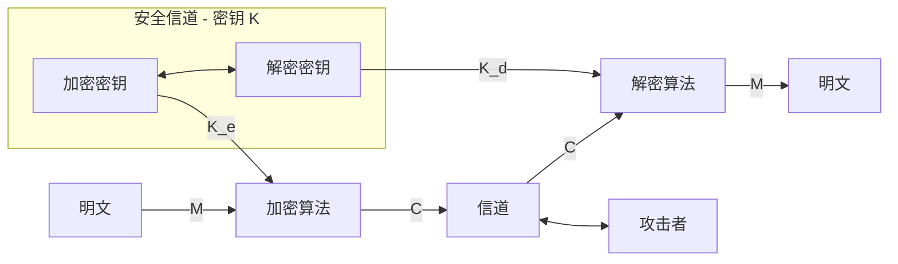

中国密码人在密码领域作出了许多杰出责献。2004年我国频布电子签名法。2006年我国政府开始陆续公布我国的商用密码算法。2007年中国密码学会正式成立。2011年9月,我国设计的祖冲之密码算法(ZUC)被批准成为新一代宽带无线移动通信系统(4G)国际标准。2015年月IS0/IEC接受 TPM2.0 为国际标准、TPM2.0支持中国商用密码(SM2、SM3、SM4)这些都是我国密码界的大事，反映出我国密码事业的紧荣与进步。

第1章 信息安全概论
传统信息安全强调信息数据本身的安全属性，认为信息安全主要包含：
1.信息的**秘密性**：信息不被未授权者知晓的属性。
2.信息的**完整性**：信息是正确的、真实的、未被篡改的、完整无缺的属性。
3.信息的**可用性**：信息可以随时正常使用的属性。

信息系统安全有以下四个层次：设备安全，数据安全，内容安全，行为安全。

网络空间安全学科的内涵：网络空间安全学科是研究信息获取、信息存储、信息传输和信息处理领域中信息安全保障问题的一门新兴学科。

网络空间安全学科的主要方向有：密码学、网络安全、信息系统安全、信息内容安全和信息对抗。

密码学：由密码编码学和密码分析学组成，密码编码学主要研究对信息进行编码以实现信息隐蔽，密码分析学主要研究通过密文获取对应的明文信息。主要研究内容有：①对称密码；②公钥密码；③Hash函数；④密码协议；⑤新型密码：生物密码，量子密码等；⑥密钥管理；⑦密码应用

1.4 网安学科理论基础
1.数学
现代密码分为基于数学的密码和基于非数学的密码（如量子密码和DNA密码），而后者正处于发展的初期没有得到广泛的实际应用。至于前者，学界普遍认为：设计一个密码就是设计一个数学函数，而破译一个密码就是求解一个数学难题。作为密码学理论基础之一的数学分支主要有代数、数论、概率统计、组合数学等。
协议安全是网络安全的核心，其基础之一的数学主要有逻辑学。
博弈论是网络空间安全学科基础理论之一，是现代数学的一个分支，是研究具有对抗或竞争性质的行为的理论与方法。博弈行为中，参加对抗或竞争的各方各自具有不同的目标或利益，并力图选取对自己最有利的或最合理的方案。博弈论考虑对抗双方的预期行为和实际行为，并研究其优化策略。

2.信息理论（信息论，控制论和系统论）。
信息论是香农为解决现代通信问题而创立的，控制论是维纳在解决自动控制技术问题中建立的，系统论是为了解决现代化大科学工程项目的组织管理问题而诞生的。
信息论对信息源、密钥、加密和密码分析进行了数学分析，用不确定性和唯一解距离来度量密码体制的安全性。信息论奠定了密码学，也奠定了信息隐藏的理论基础。
系统论是研究系统的一般模式、结构和规律的科学。
控制论研究动态系统在变化的环境条件下如何保持平衡状态或稳定状态。“控制”被定义为，为了改善受控对象的功能或状态，获得并使用一些信息，以这种信息为基础施加到该对象上的作用。

3.计算理论是网安学科重要理论基础
其中包括可计算性理论和计算复杂性理论等。
“一次一密”密码是理论上安全的密码，其余密码都只能是计算上安全的密码。根据计算复杂性理论的研究，NPC类问题是困难的，NPC类问题是NP类中最难计算的一类问题。公钥密码的构造往往基于一个NPC问题，以此期望密码是计算上安全的。NPC问题，以此期望密码是计算上安全的。如McEliece密码基于纠错码的一般译码是NPC问题。背包密码基于求解一般背包问题是NPC问题。MQ密码基于多变量二次非线性方程组的求解问题是NPC问题，等等。这说明计算复杂性理论是密码学的理论基础之一。

4.密码学理论是网络空间安全学科所特有的理论基础。
密码学在发展中超越了传统的信息论，形成了一些新理论，如：单向陷门函数理论、零知识证明理论以及密码设计与分析理论。因此，密码学理论是网安学科的理论基础，而且是网络空间安全学科特独有的理论基础。

5.访问控制理论是网络空间安全学科所特有的理论基础。
如信息系统中的身份认证就是最基本的访问控制。密码技术可以看作访问控制（密码技术中密钥就是权限，有密钥就可获得信息）。
访问控制理论包括各种访问控制模型与授权理论。例如，矩阵模型、BLP模型、BIBA模型、中国墙模型、基于角色的模型（RBAC）、属性加密，等等。其中属性加密是密码技术与访问控制结合的新型访问控制。

**综上可知，数学、信息理论（信息论、系统论、控制论）、计算理论（可计算性理论、计算复杂性理论）是网络空间安全学科的理论基础，而博弈论、密码学理论和访问控制理论是网络空间安全学科所特有的理论基础。**

1.5 网安学科的方法论基础
笛卡尔《方法论》中研究方法划分为四步：1.所有真理结论皆可怀疑。2.复杂问题拆分成小问题逐一解决。3.小问题先简单再复杂依次解决。4.所有问题解决后再综合检验看是否完全解决。
此方法忽略各个部分关联和彼此影响，有些复杂问题无法分解，推动系统工程的出现。（传统方法论→系统性方法论）

网安的方法论：将以上两者结合。包括理论分析、逆向分析、实验验证、技术实现。
强调底层性、系统性。
其中，逆向分析是网安学科特有方法论。因为信息安全领域的斗争，本质上是攻防双方之间的斗争。网络安全由网络安全防护和网络攻击组成，要从攻防两方面研究。

1.6 密码是网络空间安全的关键技术
密码技术的基本思想是对信息进行伪装以隐蔽信息。伪装就是对数据进行一组可逆的数学变换。伪装前的数据称为明文（Plaintext），伪装后的数据称为密文（Ciphertext）。伪装的过程称为加密（Encryption），去掉伪装恢复明文的过程称为解密（Decryption）。加解密要在密钥（Key）的控制下进行。
将数据以密文的形式存储在计算机的文件中或送人网络信道中传输，而且只给合法用户分配密钥。这样，即使密文被非法窃取，因为未授权者没有密钥而不能得到明文。
1949年香农发表《保密系统的通信理论》著名论文，对信息源、密钥、加密和密码分析进行了数学分析，用不确定性和唯一解距离来度量密码体制的安全性，阐明了密码体制、完善保密、纯密码、理论保密和实际保密等重要概念，把密码置于坚实的数学基础之上，标志着密码学作为一门独立的学科的形成。
很多情况下，难以预约使用相同密钥，密钥的传递过程中的保密工作本身就有难度。
1976年W.Diffie和M.E.Hellman提出公开密钥密码（PublicKeyCryptosystem）的概念，从此开创了一个密码新时代。公开密钥密码从根本上克服了传统密码在密钥分配上的困难，特别适合计算机网络应用，而且实现数字签名容易，因而特别受到重视。计算机网络中将公开密钥密码和传统密码相结合已经成为网络中应用密码的主要形式。
公认比较安全的公开密钥密码有：基于大整数因子分解困难性的RSA密码、基于有限域上离散对数问题困难性的ELGamal密码和基于椭圆曲线离散对数问题困难性的椭圆曲线密码（ECC）等。
1977年美国颁布了数据加密标准DES(Data Encryption Stantard),这是密码史上的一个创举。1973年，美国国家标准局(NBS)向社会公开征集一种用于政府机构和商业部门对非机密的敏感数据进行加密的加密算法。经美国国家安全局(NSA)评测后，选中了IBM公司设计的算法，颁布为标准DES。DES开创了向世人公开加密算法的先例。它设计精巧、安全、方便，是近代密码成功的典范。它成为商用密码的国际标准，为确保信息安全作出重大贡献。DES的设计充分体现了Shannon信息保密理论所阐述的设计密码的思想，标志着密码的设计与分析达到了新的水平。1998年年底美国政府宣布不再支持DES,DES完成了它的历史使命。1999年美国政府颁布三重DES为新的密码标准。三重DES已得到许多国际组织的认可，我国银行系统也采用三重DES。
1994年美国颁布了密钥托管加密标准EES（Escrowed Encryption Stantard）。EES密码算法被设计成允许法律监听的保密方式。EES只提供密码芯片，不公开密码算法。广受攻击。
1997年，重新公开征集新的数据加密标准算法AES（Advanced Encryption Stantard），成为美国国家标准，逐渐成为国际标准。我国银行系统现在也采用AES。也是全世界目前最常用。
1994年，美国颁布数字签名标准DSS（Digital Signature Stantard），并实际上成为国际标准。我国于1995年颁布自己的数字签名标准（带消息恢复的数字签名方案GB15851——1995）。
1995年，美国犹他州颁布世界上第一部《数字签名法》。2004年我国颁布《中华人民共和国电子签名法》。
2006年1月，我国政府公布了商用分组密码算法SM4，以后又陆续公布了商用公约密码算法SM2和商用HASH函数算法SM3。2006年我国制定了《可信计算平台密码技术方案》，明确规定了中国的可信计算密码模块（TCM）所应采用的中国商用密码算法。2007年中国密码学会正式成立。
2007年，美国NIST公开征集HASH函数新标准SHA-3，更为安全，可并行实现以获得很高的效率。可在多种平台包括智能卡等资源受限的平台中实现。

目前，针对密码破译的计算算法主要有两种。第一种是1996年提出的通用搜索破译法，第二种是1997年提出的在量子计算机上求解整数因子分解和求解离散对数问题的多项式时间算法。（对于后者算法的研究还在发展，其攻击能力已有量子傅里叶变换推广到一般情况下的隐藏子群问题，因此凡是可归结到HSP的公钥密码都不能抵抗量子计算的攻击）。

为对抗量子计算机攻击，有以下三种密码（抗量子计算密码）：基于量子物理学的量子密码，基于生物学的DNA密码和基于数学的抗量子计算密码。
1.量子密码。量子密码基于量子物理学。量子密码中比较成熟的是量子密钥分配（QKD）技术。它利用量子物理技术产生真随机数用作密钥，通过具有天然保密性的量子通信进行密钥分配，然后利用传统的序列密码方式对明文加密，密钥的使用采用“一次一密”。理论上，由于密钥随机且只用一次，分配信道是具有天然保密性的量子通信，量子态的测不准原理和量子态的不可克隆、不可删除原理确保了量子通信是安全的。
2.DNA密码。DNA计算有电子计算所无法比拟的优点，如高度并行性、极高的存储密度和极低的能量消耗。
3.基于数学的抗量子计算密码。量子计算机之所以能够有效攻击RSA、ELGmal、ECC等密码，是因为它擅长计算广义离散傅里叶变换问题，而据此可依据量子计算机不擅长计算的数学问题来构造抗量子计算密码。例如，基于二次方程组求解困难性的MQ密码，基于格困难问题的格密码等。

第二章  密码学的基本概念
2.1 密码学的基本概念
传统密码由于其在密钥分配上的困难而限制了它在计算机网络中的应用，在这种情况下产生了公开密钥密码。公开密钥密码从根本上克服了传统密码在密钥分配上的困难，而且实现数字签名容易，因而特别适合计算机网络和分布式计算机系统的应用。目前，在计算机网络中将公开密钥密码和传统密码相结合已经成为网络密码应用的主要形式
量子计算具有天然的并行性，所以量子计算机计算能力强大。

2.1.1密码体制
一个密码系统，通常简称为密码体制（Cryptosystem），由五部分组成：
① 明文空间 **M**，它是全体明文的集合。
② 密文空间 **C**，它是全体密文的集合。
③ 密钥空间 **K**，它是全体密钥的集合。其中每一个密钥 K 均由加密密钥 K_e 和解密密钥 K_d 组成，即 K = <K_e , K_d>。
④ 加密算法 **E**，它是一族由 **M** 到 **C** 的加密变换。
⑤ 解密算法 **D**，它是一族由 **C** 到 **M** 的解密变换。
对于每一个确定的密钥，加密算法将确定一个具体的解密变换，而且解密变换就是加密变换的逆变换。对于明文空间 **M** 中的每一个明文 $M$，加密算法 **E** 在密钥 $K_e$ 的控制下将明文 $M$ 加密成密文 $C$：

$$C = E(M, K_e) \quad (2\text{-}1)$$

而解密算法 **D** 在密钥 $K_d$ 的控制下由密文 $C$ 解密出同一明文 $M$：

$$M = D(C, K_d) = D(E(M, K_e), K_d) \quad (2\text{-}2)$$

| 符号      | 英文全称                                  | 含义                           |
| ------- | ------------------------------------- | ---------------------------- |
| **M**   | **M**essage / **M**essage space       | 明文 / 明文空间（也常用 P = Plaintext） |
| **C**   | **C**iphertext / **C**iphertext space | 密文 / 密文空间                    |
| **K**   | **K**ey / **K**ey space               | 密钥 / 密钥空间                    |
| **E**   | **E**ncryption                        | 加密算法 / 加密函数                  |
| **D**   | **D**ecryption                        | 解密算法 / 解密函数                  |
| **K_e** | **K**ey for **e**ncryption            | 加密密钥                         |
| **K_d** | **K**ey for **d**ecryption            | 解密密钥                         |
|         |                                       |                              |
|         |                                       |                              |

异或，即模2加法。两次异或⊕可得原文

2.1.2 密码分析
密码分析者攻击密码主要有三种方法：
1.穷举攻击。
依次试遍所有可能的密钥对所获得的密文进行解密。理论上，所有密码穷举可破；平均角度讲，穷举破译至少试遍所有可能密钥的一半。
应对：增大密钥量或增大加密算法复杂性。
2.数学攻击。
针对加密算法的数学基础和某些密码学特性，通过数学求解来破译。
应对：让这个基于数学难题的密码计算复杂性大到实际上不可计算。
eg.统计攻击：分析密文和明文的统计规律，大部分的古典密码可由此解。应对方法是设法使明文的统计特性不带入密文。
还有差分攻击、线性攻击、代数攻击、相关攻击等等。
3.物理攻击
针对密码系统或者密码芯片的物理特性，通过数学和物理的分析来破译密码。
物理攻击的理论依据是，任何密码算法在以硬件的形式工作时，必然与其工作环境发生物理交互，相互作用，相互影响。于是，攻击者就可以主动策划实施并检测这种交互、作用和影响，从而获得有助于密码分析的信息。这类信息被称为侧信道信息SCI（SideChannelInformation）。
基于侧信道信息的密码攻击被称为侧信道攻击或侧信道分析SCA（SideChannel attack/Analysis）。常用的侧信道信息有，能量消耗信息、时间消耗信息、声音信息，电磁辐射信息，等等。常见的侧信道攻击方法有，能量分析攻击、时间分析攻击、声音分析攻击、电磁辐射分析攻击、故障攻击，等等。
发展水平较高。有效攻击范围覆盖所有密码，包括传统密码（分组密码与序列密码）、公钥密码（RSA、ECC、EIGamal等）。

依据密码分析者的可用资源，密码攻击分以下四种：
1.仅知密文攻击2.已知明文攻击。3.选择明文攻击 4.选择密文攻击

2.1.3 密码学的理论基础
香农《保密系统的通信理论》从信息论的角度对信息源、密钥、加密和密码进行了数学分析，用不确定性和唯一解距离来度量密码体制的安全性，阐明了密码体制、完善保密、纯密码、理论保密和实际保密等重要概念，把密码置于坚实的数学基础之上，标志着密码学作为一门独立的学科的形成。
香农建议采用扩散（Diffusion）、混淆（Confusion）和乘积迭代的方法设计密码，并且还以“揉面团”的过程形象地比喻扩散、混淆和乘积迭代的概念。
扩散：就是将每一位明文和密钥数字的影响扩散到尽可能多的密文数字中。
混淆：使密文和密钥之间的关系复杂化。

2.2古典密码
2.2.1置换密码：只**重排**明文字符的位置而不改变字符本身，因此密文的字符频率和明文完全一致，仅靠字母频率分析就容易被攻破。
2.2.2代替密码：（1）加法密码（凯撒）（2）乘法密码（i先乘k再取模n,得j）（3）仿射密码（j=ik_1​+k_0 ​mod n）（4）密钥词语代替密码。如 山西平遥日昇昌票号使用笔迹认证、水印认证与密押认证（多表代替密码）。
2.2.3代数密码：
知识点：在数学上，如果一个变换的正变换和逆变换相同，f = f⁻¹，则称其为对合运算。例如，模 2 加运算 ⊕ 就是一种对合运算。因此，在密码设计中都希望将其加密算法设计成对合运算，这样使加解密共用同一算法，工程实现工作量减少一半。例如，著名的 DES 和 IDEA 等密码的加密运算都是对合运算。（比如说取相反数、取倒数等）
模二加=异或，异或（XOR）两次还原（相同得 0，不同得 1）
真正的随机数来自物理等熵源场景，纯靠算法必然伪随机。**真随机数来自物理熵源**（量子噪声、热噪声、放射性衰变等），其不可预测性是**物理性质**。 **纯算法产生的必然是伪随机**：由种子 + 确定性算法生成，统计上再漂亮也能被复现，因此**不能用于一次一密**等要求"完美保密"的场景。

2.3 古典密码的统计分析
2.3.1 语言的统计特性 字母E以及某些字母组常见
2.3.2 古典密码分析 
加法密码穷举破解（如凯撒密码26种）；
乘法密码更容易破解，因为密钥整数k满足条件（n,k)=1即k与n互素，情况更少【φ(n) 表示在 1 到 n 这些整数中，与 n 互素的数有多少个，若n为素数φ(p)=p−1，若n为两不同素数乘积时φ(pq)=(p−1)(q−1)，若都不是则使用复杂的通用公式】；
仿射密码好一点，但可能的密钥也只有nφ(n)-1种【k1合法取值φ(n)，k2合法取值n】比如字母表的话只有26\*12-1=311种）

2.4 SuperBase密码的破译
实操。

**什么是信息隐藏**
**【没看懂】信息论也奠定了信息隐藏的基础。从信息论角度看，信息隐藏（嵌入）可以理解为在一个宽带信道（原始宿主信号）上用扩频通信技术传输一个窄带信号（隐藏信息）。尽管隐藏信号具有一定的能量，但分布到信道中任意特征上的能量是难以检测的。隐藏信息的检测是一个有噪信道中弱信号的检测问题。因此，信息论构成了信息隐藏的理论基础。**

**【没看懂，因为没看懂括号内容所以不理解紧迫性】目前，针对密码破译的计算算法主要有两种。第一种是1996年提出的通用搜索破译法，第二种是1997年提出的在量子计算机上求解整数因子分解和求解离散对数问题的多项式时间算法。（对于后者算法的研究还在发展，其攻击能力已有量子傅里叶变换推广到一般情况下的隐藏子群问题，因此凡是可归结到HSP的公钥密码都不能抵抗量子计算的攻击）。
对于我国来说，问题的紧迫性还在于，我国的居民二代身份证正在使用256位的椭圆曲线密码，而且许多电子商务系统正在使用1024位的RSA密码。**

**【留了一个RAS的密码，没太看懂，明天接着看。包括：为什么实现数字签名更容易？】**